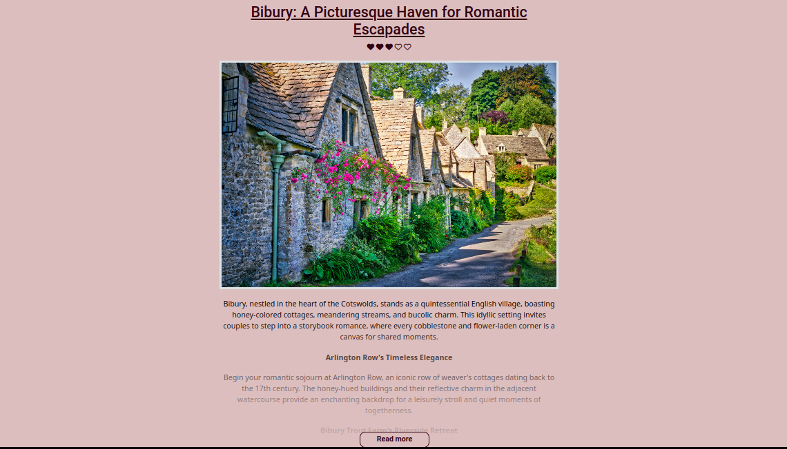
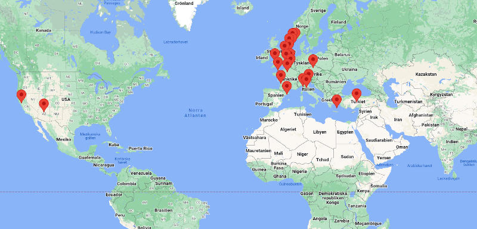
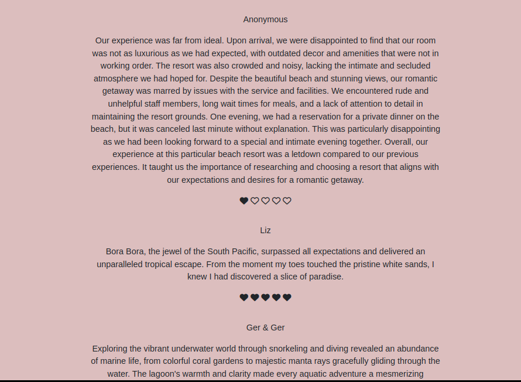

# Code Cupids (Hackathon team 10)
Team repo for Feb Hackathon '24

## **Intro**
Valentine Ventures is designed to help users find romantic places to bring their special someone on Valentine's Day. The app allows the user to find locations worldwide. The user enters the country or city/region of choice and then finds a selection of romantic destinations in the chosen area. Alternatively, users can check the map for destinations or simply browse all destinations.

The list of destinations presents each destination with a picture, an average rating, and a brief description of the place. Clicking through to a destination reveals the full information along with reviews left by users. Here, the user can also leave a review to share their thoughts about the location and their experiences there.

## **Deployment**

[Deployed project can be found here](https://travelcupid-8ccb9d827f84.herokuapp.com/)

## Features

__Destinations__

The main page of the site is a vibrant hub full of romantic destinations for all tastes.
Each destination has a picture and an introductory text to give the user a first impression of the location.
There's also an average score displayed (as a number of hearts) for each destination, based on the reviews on its page.
To learn more and see the reviews, the user can click through to the chosen destination.

__Map View__

Visitors can also view the locations on a map to see where they are and how far away.
This way, a potential traveler can choose a destination based on its location first and then read about it,
rather than the other way around.

__Search__

The search bar gives suggestions of locations in response to input.
For example, typing in an 'S' will give suggestions such as "Spain," "Serbia," and "Stockholm."
Clicking a suggestion autocompletes the search input. This way, visitors can quickly filter destinations based on desired location.

__Reviews__

Users can easily leave a review using the review form. Reviews are on display under each destination's information section.
Each review displays 1-5 hearts to give a quick overview before reading about their opinions.

### Forking the GitHub Repository

## **Planning Stage**
The planning was as follows
  1. Select a project.
  2. Create user stories and dev tasks using Github Kanban board.
  3. Assign user stories to EPICS
  4. Create labels using MoSCoW method.
  6. Develop a wireframes of the potential app.
  7. Select colours for the app.
  8. Select fonts for the app.

[Github Kanban board can be found following this link](https://github.com/users/SamMartin92/projects/6)

While some variations can be visible in end product, we believe planning helped us to successfully work on this project and we tried to stay with choices made during the planning stage.

### **Site Goals**

#### Objectives

The objective of the app is to allow the user to easily find romantic locations around the world, to have the ability to read reviews from people who visited these sites.

#### Target Audience
Our target audience is any gender adult, aged 18+, who is in a relationship or married, is a user of smartphones, of varied income and based anywhere in the world. 

### Color Pallette

### **Wireframes**

For this project, we made wireframes to help with planning and design. While some changes were made as we went along and ideas were added to our project, original wireframes can be found below:

## Technologies Used

### Main Languages Used

- HTML5
- CSS3
- Python
- Javascript

### APIs Used
- [Maps JavaScript API](https://developers.google.com/maps/documentation/javascript/overview) - Google Maps API displays map with markers on each romantic location

### Frameworks, Libraries & Programs Used

- Django - Python framework for easy backend development
- Google Fonts - for the font families:
- Font Awesome - to add icons to site
- VSCode, GitPod, & Codeanywhere - where all site files were developed 
- GitHub - to store my repository for submission.
- Bootstrap - CSS library for styling

## **Credits**
Thank you for the team effort to:

* [Viola](https://github.com/violaberg)
* [Sam](https://github.com/SamMartin92)
* [Chris](https://github.com/CMed01)
* [Emil](https://github.com/EmilionR)
* [Declan](https://github.com/Declan444)
* [Laura](https://github.com/laurakond)
* [Steph](https://github.com/StephShobiye)
